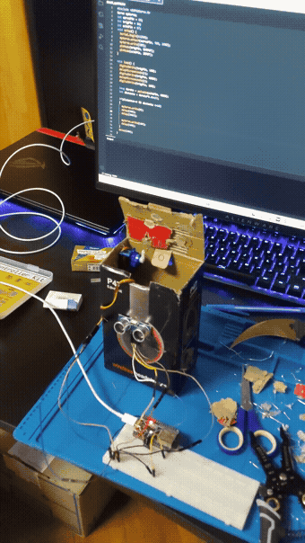

# Touchless Smart Bin

**Wave a hand near the lid and it opens by itself — no touching a bin lid with dirty
hands.** An ESP32, an ultrasonic sensor and a servo, in a cardboard prototype box.



*Hand within ~10 cm → lid opens for 3 s → closes. [🔊 same clip, with sound](docs/demo.mp4).*

---

## How it works


The ESP32 polls the ultrasonic sensor continuously. The moment something is within **10 cm**,
the servo swings the lid open, holds it for **3 seconds**, then closes it again. No arming,
no button — it just reacts.

## Stack

| Layer | Tech |
|---|---|
| Hardware | ESP32, HC-SR04 ultrasonic sensor, SG90-style servo, cardboard prototype enclosure |
| Firmware | Arduino / C++ — `ESP32Servo` |

## Running it

```
# Wiring
#   HC-SR04: trig -> GPIO16, echo -> GPIO17
#   Servo signal -> GPIO18

# Flash
#   open the .ino in Arduino IDE, board "ESP32 Dev Module", Upload
```

No credentials, no WiFi — this one runs fully standalone.

## Behaviour

- Opens for objects within **~10 cm** of the sensor.
- Stays open a fixed **3 seconds**, then closes regardless of whether the hand is still there.
- Servo mounting was the fiddly part in practice: positioned as close to the lid as possible
  without the closing lid striking the servo horn.

## Known limitations

- **The open period is a blocking `delay(3000)`** — the sensor isn't re-checked while the lid
  is open, so holding a hand there doesn't extend it; it always closes after exactly 3 s.
- **A failed sensor reading can falsely open the lid.** `pulseIn()` returns `0` when the
  HC-SR04 gets no echo back (e.g. a bad reflection); `0` satisfies `distance <= 10`, so a
  failed reading looks identical to "something is right at the sensor." A safer check would
  require `distance > 0` too.
- No debounce on the distance reading — a single noisy sample can trigger the servo.
- Cardboard prototype enclosure, not a finished product.
